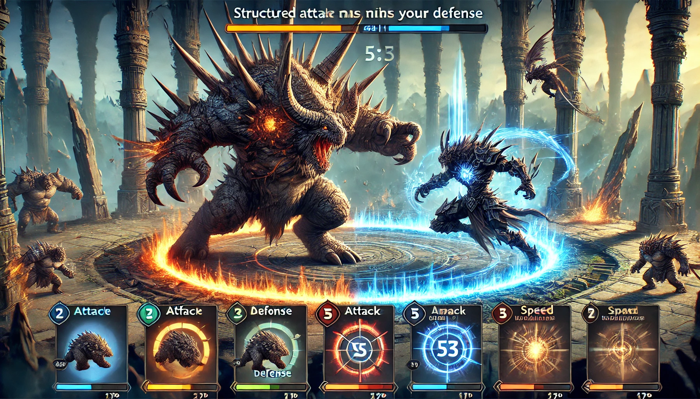

# Monster Brawl

 [English](README.md) |  [**Portuguese**](LEIAME.md)  

O aplicativo "Monster Brawl" é um jogo interativo onde diferentes monstros, com estatísticas únicas como ataque e defesa, enfrentam-se. O projeto inclui uma API que permite o gerenciamento de monstros e batalhas, proporcionando uma experiência emocionante e dinâmica.



## Proposta

O objetivo é criar uma aplicação Ruby on Rails que explore as regras do jogo e ensine como utilizar [RSpec](https://rspec.info/) para criar testes automatizados. Este projeto guiará você na configuração da aplicação, implementação da lógica do jogo e escrita de testes para garantir a correção do código.

A melhor parte é que você aprenderá a usar **arquivos CSV** para importar dados para o banco de dados, tornando o processo de criação de monstros e batalhas mais eficiente.

## Algoritmo do Monster Brawl

Para calcular o algoritmo de batalha, siga o fluxo abaixo:

* O monstro com maior velocidade faz o primeiro ataque; se ambas as velocidades forem iguais, o monstro com maior ataque ataca primeiro.
* Para calcular o dano, subtraia a defesa do ataque `(ataque - defesa)`. A diferença será o dano; se o ataque for igual ou menor que a defesa, o dano será 1.
* Subtraia o dano do HP `(HP = HP - dano)`.
* Os monstros lutarão em turnos até que um vença. Todos os turnos devem ser calculados na mesma requisição; por isso, o endpoint da batalha deve retornar os dados do vencedor em uma única chamada.
* O vencedor da batalha é o monstro que reduzir o HP do inimigo a zero.

---

# Configuração

Para executar o projeto, é necessário ter as seguintes ferramentas instaladas:

* [Docker](https://docs.docker.com/get-docker/)
* [Docker Compose](https://docs.docker.com/compose/install/)

Após executar os comandos acima, o banco de dados será criado e as migrações serão executadas. Em seguida, crie um arquivo `.env` com o seguinte comando:

```bash
cp docker/api/.env.example docker/api/.env
```

Agora, construa a imagem da aplicação:

```bash
docker compose build api
```

Depois disso, execute o seguinte comando para popular o banco de dados:

```bash
docker compose run api rails db:seed
```

## Executando o Projeto

Para rodar o projeto, utilize o comando:

```bash
docker compose up
```

Agora, você pode acessar a API em `http://localhost:8000`.

---

# Endpoints da API

A API possui os seguintes endpoints:

## Monstros

* `GET /monstros`: Retorna todos os monstros.
* `GET /monstros/:id`: Retorna um único monstro.
* `POST /monstros`: Cria um novo monstro.
* `PUT /monstros/:id`: Atualiza um monstro.
* `DELETE /monstros/:id`: Deleta um monstro.
* `POST /monstros/importar`: Importa todos os objetos do arquivo CSV para o banco de dados.

## Batalhas

* `GET /batalhas`: Retorna todas as batalhas.
* `POST /batalhas`: Cria uma nova batalha.
* `DELETE /batalhas/:id`: Deleta uma batalha.

---

# Testes RSpec com Factory Bot

## Cobertura de Testes

A cobertura de testes é de 100% para os modelos e controladores. Os testes foram criados utilizando [RSpec](https://rspec.info/) e [FactoryBot](https://github.com/thoughtbot/factory_bot). Temos os seguintes testes:

### **Controller de Monstros**

- Retorna todos os monstros corretamente.
- Retorna um único monstro corretamente.
- Retorna erro 404 se o monstro não existir.
- Cria um novo monstro corretamente.
- Atualiza um monstro corretamente.
- Retorna erro 404 ao tentar atualizar um monstro inexistente.
- Deleta um monstro corretamente.
- Retorna erro 404 ao tentar deletar um monstro inexistente.
- Importa todos os objetos CSV no banco de dados com sucesso.
- Retorna erro ao importar um arquivo CSV com colunas inexistentes.
- Retorna erro ao importar um arquivo CSV com colunas erradas.
- Retorna erro ao importar um arquivo com extensão diferente de CSV.
- Retorna erro ao tentar importar sem fornecer um arquivo.

Para acessar o arquivo, clique [aqui](api/spec/controllers/monster_controller_spec.rb).

### **Controller de Batalhas**

- Retorna todas as batalhas corretamente.
- Retorna erro de bad request ao criar batalha com um parâmetro nulo.
- Retorna erro de bad request ao criar batalha com um monstro inexistente.
- Cria uma batalha corretamente com o monstro A vencendo.
- Cria uma batalha corretamente com o monstro B vencendo, tendo defesa igual e velocidade maior.
- Deleta uma batalha corretamente.
- Retorna erro 404 ao tentar deletar uma batalha inexistente.

Para acessar o arquivo, clique [aqui](api/spec/controllers/battle_controller_spec.rb).

Leia mais sobre os testes no arquivo [COBERTURA-DE-TESTE.md](COBERTURA-DE-TESTE.md).

## Executando os Testes

Para rodar os testes, execute o seguinte comando:

```bash
docker compose run api rspec
```


---

# Próximos Passos

- Implementar um recurso para permitir que os usuários criem seus próprios monstros e batalhas por meio da interface.
- Adicionar um ranking para exibir os melhores monstros com base nas vitórias.

---

# Conclusão

Este projeto oferece uma experiência de aprendizado completa no desenvolvimento de uma aplicação Ruby on Rails com foco em habilidades de teste. Ao trabalhar neste projeto, você ganhará experiência valiosa em:

- Acessar e gerenciar uma API para lidar com monstros e batalhas.
- Utilizar o RSpec para criar testes automatizados, garantindo a correção e confiabilidade do código.
- Importar dados de arquivos CSV para popular o banco de dados com eficiência.

Essas habilidades são essenciais para construir aplicações robustas e manuteníveis, e este projeto proporciona uma abordagem prática para dominá-las.